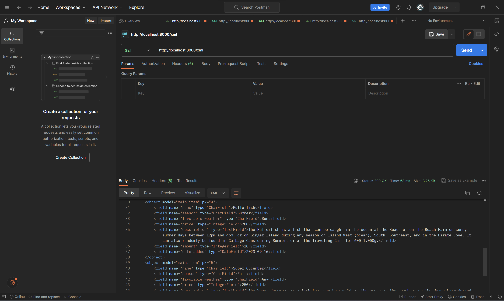
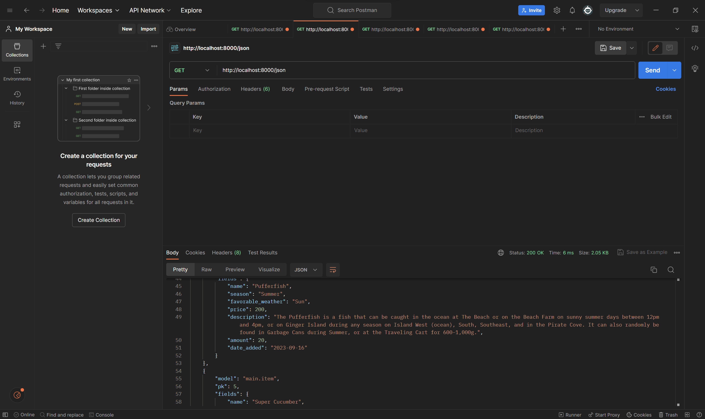
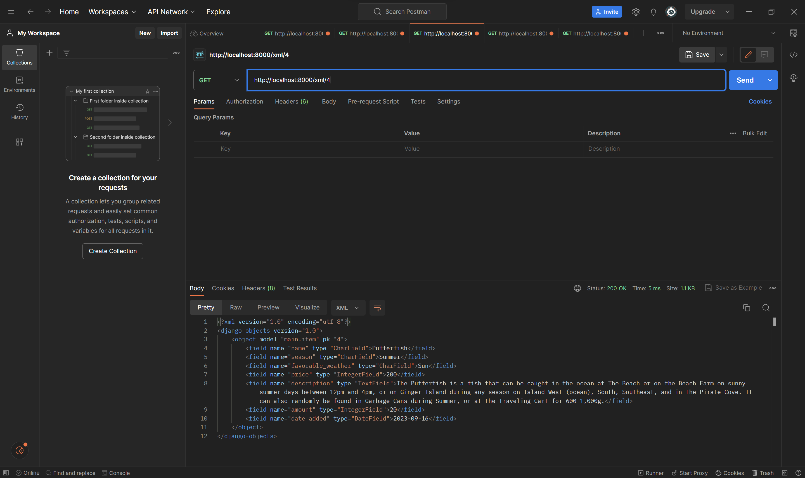
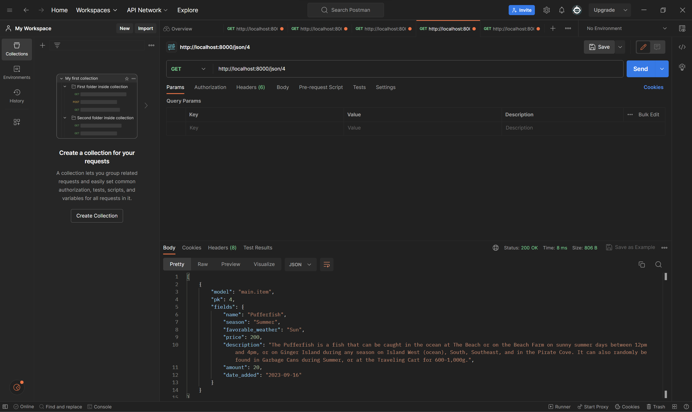
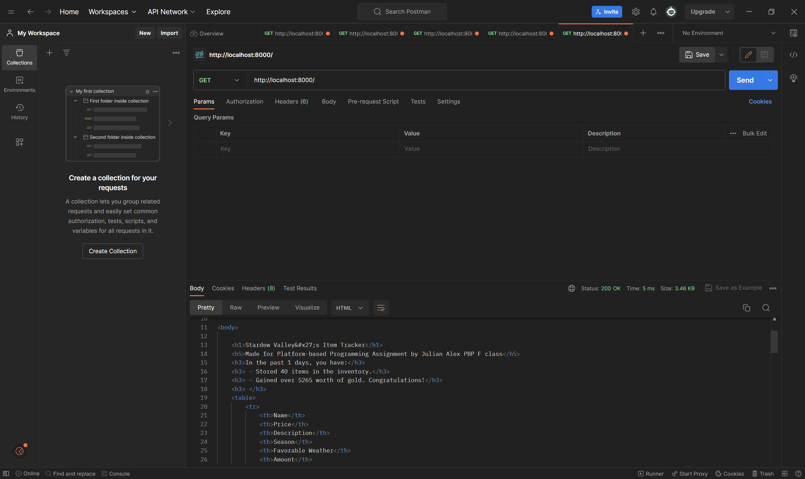

# Tugas 2
##### Jelaskan bagaimana cara kamu mengimplementasikan *checklist* secara *step-by-step* (bukan hanya sekedar mengikuti tutorial)
1. Langkah pertama dalam mengimplementasikan *checklist* adalah membuat projek Django. Saya melakukan ini dengan membuat proyek Django baru dengan nama "stardew_tracker" dengan sintaks `django-admin startproject stardew_tracker` 
2. Membuat aplikasi Django baru bernama "main" dengan sintaks `python manage.py startapp main`
3. Setelah membuat aplikasi baru, proyek akan dilakukan routing pada `urls.py` agar dapat menjalankan aplikasi "main" dengan sintaks
    ```
    urlpatterns = [
        path('', include('main.urls')),
        path('admin/', admin.site.urls),
    ]
    ```
4. Membuat *class* `Item ` pada `model.py` dan menambahkan atribut-atribut wajib, yaitu `name`, `amount`, dan `description`. Selain itu, saya menambahkan atribut-atribut lain untuk memberikan informasi lebih jelas mengenai suatu *item* dan menyesuaikan tema aplikasi yang ingin dibuat, yaitu `season`, `favorable_weather`, dan `price`.
5. Membuat fungsi `show_main` pada `views.py` yang akan dikembalikan *dictionary* `context` yang berisikan `application_name`, `name`, `item_name`,`season`, `favorable_season`, `price`, `description`, `amount` ke dalam *template* html untuk 
6. Membuat routing pada aplikasi untuk memetakan fungsi `show_main` yang telah dibuat pada `views.py` dengan sintaks
    ```
    urlpatterns = [
        path('', show_main, name='show_main'),
    ]
    ```
7. Membuat *test case* untuk aplikasi yang mengkonfirmasi bahwa saat mengakses URL `/main/`, halaman web merespon dengan status kode 200, menggunakan template `main.html`, dan berisi teks 'Stardew Valley's Item Tracker'. Selain itu, *test case* dibuat untuk memastikan *method* `calculate_total` pada *class* `Item` mengembalikan nilai total yang benar dan mengetes *method* `__str__` untuk memastikan *method* tersebut mengembalikan nama *item* yang sesuai.
8. Melakukan *deployment* ke Adaptable dengan memilih `Python App Template` sebagai *template deployment*, memilih `PostgreSQL` sebagai tipe basis data yang digunakan, menggunakan Python versi `3.11`, memasukkan perintah `python manage.py migrate && gunicorn stardew_tracker.wsgi` pada bagian `Start Command`, dan mencentang bagian `HTTP Listener on PORT`. Lalu, mengeklik `Deploy App` untuk memulai proses *deployment* aplikasi 

##### Buatlah bagan yang berisi request client ke web aplikasi berbasis Django beserta responnya dan jelaskan pada bagan tersebut kaitan antara `urls.py`, `views.py`, `models.py`, dan berkas `html`.
*Request Client*:  Merupakan permintaan HTTP yang dikirim oleh browser klien ke aplikasi web Django
|
|
v
` urls.py`: Mengatur routing dan menentukan jalur URL yang akan mengeksekusi fungsi `show_main` di             `views.py`
| 
|
v
`views.py`: Mengekskusi `show_main`. Fungsi tersebut bertanggung jawab untuk mengatur respon yang akan         dikirimkan kembali ke *browser*
|
| 
v
`models.py`: `views.py` dapat berinteraksi dengan model data yang didefinisikan di `models.py`. Model ini mengatur struktur dan logika data aplikasi.
|
| 
v
*Template* `HTML`:Digunakan untuk me-*render* `views.py`
| 
|
v
*Response*: Respon yang dihasilkan oleh Djnago yang berisikan tampilan HTML yang telah di-*render*
| 
|
v
*Client Browser*: Me-*render* halaman web sesuai respons yang diterima

##### Jelaskan mengapa kita menggunakan *virtual environment?* Apakah kita tetap dapat membuat aplikasi web berbasis Django tanpa menggunakan *virtual environment*?

- Dengan menggunakan *virtual environment*, aplikasi yang akan dibuat akan tetap stabil dan konsisten dalam *environment-environment* di dalam perangkat lain. *Virtual environment* juga digunakan untuk memastikan bahwa setiap orang yang bekerja pada pembuatan web menggunakan *dependencies* yang sama. Membuat aplikasi web berbasis Django tanpa menggunakan *virtual environment* dapat menyebabkan masalah kompabilitas dan akan menyulitkan konsistensi *environment* ketika akan melakukan proses *deployment*

##### Jelaskan apakah itu MVC, MVT, MVVM dan perbedaan dari ketiganya.
- MVC (Model-View-Controller): Konsep arsitektur yang digunakan dalam pengembangan web dengan memisahkan *Model*, *View*, dan *Controller*. *Model* digunakan untuk menyimpan data dan logika aplikasi, *View* digunakan untuk menampilkan data dari model yang telah dibuat. *Controller* digunakan untuk menghubungkan *Model* dan *View*. MVC dapat digunakan dalam berbagai platform pengembangan perangkat lunak.
- MVT (Model-View-Template): Konsep arsitektur yang digunakan dalam pengembangan web dengan memisahkan *Model*, *View*, dan *Template*. *Template* digunakan untuk menghubungkan *Model* dan *View*. *Model* digunakan untuk menyimpan data dan logika aplikasi, *View* digunakan untuk menampilkan data dari model yang telah dibuat. MVT adalah konsep khusus dalam Django *framework* untuk pengembangan web.
- MVVM (Model-View-ViewModel): Konsep arsitektur yang digunakan dalam pengembangan aplikasi berbasis *user interface* (UI) dengan memisahkan *Model*, *View*, dan *ViewModel*. *Model* digunakan untuk menyimpan data dan logika aplikasi, *View* digunakan untuk menampilkan data dari model yang telah dibuat, dan *ViewModel* untuk mengelola logika dari aplikasi.MVVM dapat digunakan dalam berbagai platform pengembangan perangkat lunak.

# Tugas 3
## Apa perbedaan antara form POST dan form GET dalam Django?
 - Salah satu Perbedaan antara `POST` dan `GET` dalam Django terletak pada visibilitas data yang akan diberikan di mana `POST` digunakan untuk mengirimkan data-data yang tersembunyi dalam permintaan HTTP dan tidak akan ditampilkan dalam URL, sedangkan `GET` digunakan untuk mengirimkan data-data yang akan ditampilkan pada URL dan dapat dilihat oleh *user*. Selain itu, perbedaan lain adalah method `GET` biasanya digunakan jika ingin mengambil data dari sebuah URL dan method `POST` digunakan untuk mengirim data-data yang bersifat sensitif.
## Apa perbedaan utama antara XML, JSON, dan HTML dalam konteks pengiriman data?
- Dalam pengiriman data, JSON menggunakan *key-value* atau *dict* sebagai format untuk komunikasi antar server. Sementara itu, XML dan HTML menggunakan *markup* dengan *tag* dan *attribute* yang mirip satu dengan yang lain, tetapi HTML digunakan untuk membuat tampilan halaman web, sedangkan XML digunakan untuk menyimpan dan mengirim data terstruktur dalam format teks
## Mengapa JSON sering digunakan dalam pertukaran data antara aplikasi web modern?
- Di antara aplikasi web modern, JSON adalah format yang sering digunakan dibandingkan format lain karena memiliki banyak kelebihan, yaitu efisiensi dalam penyimpanan data dengan *size* yang relatif kecil. Selain itu, *parser* untuk format JSON tersedia di banyak bahasa pemrograman, membuatnya mudah untuk ditulis dalam kode. JSON juga mudah dibaca oleh manusia dan mendukung tipe-tipe data standar, seperti *String* dan *Integer*.
## Jelaskan bagaimana cara kamu mengimplementasikan checklist di atas secara step-by-step (bukan hanya sekadar mengikuti tutorial).
- Untuk membuat *input* `form`, terlebih dahulu, saya membuat file `forms.py` lalu membuat *class* `Meta` dengan `model` yang berisikan `item` pada `models.py` dan `fields` yang berisikan: `name`, `price`, `description`, `season`, `favorable_weather`, `amount` (Sesuai dengan website yang ingin saya buat). Setelah itu, saya membuat method `create_product` yang nantinya akan menambahkan data *item* secara otomatis ketika *user* menekan tombol *submit* dari *form* dan menambahkan variabel untuk mengambil seluruh object Item yang akan disimpan pada *database* di `views.py` serta menambahkan `path` ke dalam `urls.py` agar *user* dapat mengakses dan meng-*input* produk ke dalam `form`. Lalu, saya membuat file `create_product.html` untuk membuat tampilan dari fungsi `create_product` dan mengubah tampilan `main.html` dengan menambahkan tabel agar dapat menampilkan *database* dari produk yang sudah di-*input*.
- Untuk melihat objek-objek yang sudah ditambahkan ke dalam `database`, saya menggunakan format HTML, XML, JSON, XML by ID, dan JSON by ID yang fungsi-fungsinya akan ditambahkan ke dalam `views.py`. Pada setiap fungsi yang dibuat, saya membuat variabel `data` yang berisikan seluruh objek dari database yang telah dibuat. Khusus untuk mengembalikan dengan ID, objek pada *database* yang ada akan di-filter sedemikian sehingga hanya terdapat ID sesuai input yang menjadi parameter. Lalu, untuk masing-masing format, saya akan me-*return* fungsi tersebut dengan *parameter* `HttpResponse` yang berbeda:

Untuk XML, parameter yang digunakan dalam `HttpResponse` adalah:
```
serializers.serialize("xml", data), content_type="application/xml"
```

Untuk JSON, parameter yang digunakan dalam `HttpResponse` adalah:
```
serializers.serialize("json", data), content_type="application/json"
```

Agar kelima fungsi tersebut dapat diakses, pada `urls.py`, *list* `url_patterns` akan ditambahkan beberapa `path` sehingga *list* `url_patterns` akan menjadi sebagai berikut:
```
urlpatterns = [
    path('', show_main, name='show_main'),
    path('create-product', create_product, name='create_product'),
    path('delete-item', delete_item, name='delete_item'),
    path('json/', show_json, name='show_json'),
    path('xml/<int:id>/', show_xml_by_id, name='show_xml_by_id'),
    path('json/<int:id>/', show_json_by_id, name='show_json_by_id'), 
    path('xml/', show_xml, name='show_xml')
]
```

*Screenshot-screenshot* akses kelima URL menggunakan Postman dapat dilihat di bawah




